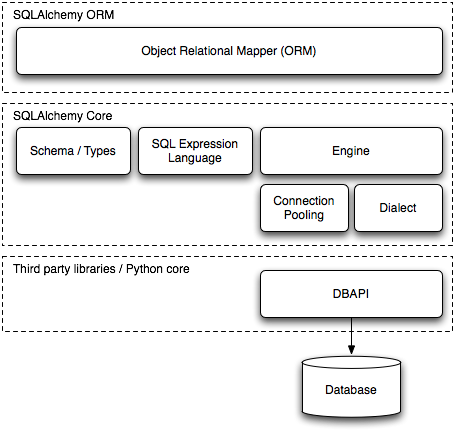

<!--
_paginate: false
-->


## Intro to SQLAlchemy

<mark>ORMs</mark> in python

---

## whois:`Bauke Brenninkmeijer`

- MSc in CS and Data Science @Nijmegen
- Data Scientist <mark>@ABNAMRO</mark> since 2019
  - 1.5 years in Data Management
  - 2 years in Global Markets

- [](https://github.com/Baukebrenninkmeijer) [@baukebrenninkmeijer](https://github.com/Baukebrenninkmeijer)


---

<!-- _class: invert -->

# Outline

1. Introduction
2. Database support
3. What is an ORM
4. Examples
5. conclusion

---

<!--
_footer: "ODBC: Open Database Connectivity"
_class: lead
 -->

# Introduction

- **SQLAlchemy**: Python SQL toolkit and ORM that gives full pythonic SQL capabilities to python
- **PyODBC**: Python module that allows executing SQL to any ODBC database
- Both support CRUD (Create, Read, Update, Delete) Operations


---

<!-- _footer: ""
_paginate: false
 -->


---

# Key differences

<style scoped>
ul {
   font-size:  70%;
}

- SQLAlchemy provides higher level of abstraction and expressiveness. More readable and maintainable code.
- SQLAlchemy supports more advanced features such as:
  - Connection pooling
  - Migrations
  - Schema reflection
- SQLAlchemy allows different styles of querying, such as declarative, classical or hybrid.

---

# Database support

<style scoped>
ul {
   font-size:  70%;
}
</style>

<ul> <li><strong>SQLAlchemy</strong> supports multiple dialects and backends, including <ul> <li>MySQL</li> <li>PostgreSQL</li> <li>SQLite</li> <li>All ODBC enabled databases</li> </ul> </li> <li><strong>PyODBC</strong> supports any database with DB API 2.0, which include: <ul> <li>SQL Sever</li> <li>Access</li> <li>Excel</li> <li>Oracle</li> </ul> </li> </ul>

<!-- - **SQLAlchemy** supports multiple dialects and backends, including
  - MySQL
  - PostgreSQL
  - SQLite
  - All ODBC enabled databases
- **PyODBC** supports any database with DB API 2.0, which include:
  - SQL Sever
  - Access
  - Excel
  - Oracle -->

---

# What is an ORM?

- **O**bject **R**elational **M**apping
- Method to align code and database structures
- Facilitates interactions with databases in code, rather than raw SQL.
- Generally done using classes or other types of attribute-wise data capture

---

# What does that mean?

- **SQLAlchemy** has ORM features that allows definition of classes that represent database tables, manipulating data using python syntax.
- **PyODBC** does not have any ORM features. You can use other ORMs on top of PyODBC, such as Django, PeeWee, and SQLAlchemy.

---

<!-- _footer: "" -->


---

# 4 APIs

SQLAlchemy actually has 2/4 different APIs

- **SQLAlchemy ORM 2.0 style**
- SQLAlchemy ORM 1.x style
- SQLAlchemy Core 2.0 style
- SQLAlchemy Core 1.x style

---

# SQLAlchemy APIs

- **ORM** provides high level interface, mapping python classes to database tables
- **Core** provides a low-level interface for executing SQL statements and manipulating metdata.

---

# What it is not

<mark>SQLAlchemy is not an analytics interface.</mark>

Large aggregations and complex groupbys are **not supported**.

It's main functions are **retrieval, insert, update and deleting** of data.

---

# Query Construction

- **SQLAlchemy**
  - Supports constructing SQL queries using Python expressions and operators.
  - Textual SQL is also supported.
- **PyODBC**
  - requires raw SQL statements as string, which are passed to the cursor object.
  - Placeholders and parameters are needed to dynamic usage and avoiding SQL injection attacks.


---


# Creating tables

```python
# SQLAlchemy
# imports...
engine = create_engine('sqlite:///:memory:', echo=True)
Base = declarative_base()

# Define a class that represents the users table
class User(Base):
    __tablename__ = 'users'
    id = Column(Integer, primary_key=True)
    name = Column(String)
    age = Column(Integer)

metadata.create_all(engine)
```

---

# Creating tables

```python
# PyODBC
import pyodbc

conn = pyodbc.connect('DRIVER={SQLite3};DATABASE=test.db')
cursor = conn.cursor()
cursor.execute('''
    CREATE TABLE users (
        id INTEGER PRIMARY KEY,
        name TEXT,
        age INTEGER
    )
''')
conn.commit()
conn.close()
```

---

### Inserting data

Python typehints ✨

```python
# SQLAlchemy
Session = sessionmaker(bind=engine)
session = Session()

# Insert some data into the table using the User class
session.add_all([
    User(name='Alice', age=25),
    User(name='Bob', age=30),
    User(name='Charlie', age=35)
])
session.commit()
```

---

# Inserting data

Just raw text. Hard to programmatically extend reliable. No SQL injection prevention.

```python
# PyODBC
cursor.execute('''
    INSERT INTO users (name, age) VALUES
    ('Alice', 25),
    ('Bob', 30),
    ('Charlie', 35)
''')
```

---

# Retrieving data

```python
from sqlalchemy import select
session.scalars(
    select(User)
).all()

```

```python
[User(id=1, name=Alice, age=25),
 User(id=2, name=Bob, age=30),
 User(id=3, name=Charlie, age=35)]
 ```

---

# Retrieving data

```python
# PyODBC
cursor.execute('SELECT * FROM users')

# Fetch and print the rows from the query result
rows = cursor.fetchall()
for row in rows:
    print(row)
```

```python
(1, 'Alice', 25)
(2, 'Bob', 30)
(3, 'Charlie', 35)
```

---

# More advanced

with table `User` and `Address`

```python
result = session.execute(
    select(User.name, Address.email_address)
    .join(User.addresses)
    .order_by(User.id, Address.id)
)
```

---

# WHERE

```python
session.scalars(select(User).where(User.age > 28)).all()
```

```python
[User(id=2, name=Bob, age=30),
 User(id=3, name=Charlie, age=35)]
```

---

# Granular inserts

```python

new_user = User(name='dennis', age=58)

session.add(
    new_user
)
session.commit()
```

---

# Granular updates

```python
from sqlalchemy import update
stmt = (
    update(User)
    .where(User.name == "Alice")
    .values(name="Alice the Third von Baumgarten")
)
session.execute(stmt)
session.commit()
```

---


# Delete

```python
from sqlalchemy import delete
stmt = delete(User).where(User.name.in_(["Bob"]))
session.execute(stmt)
```

---

<!-- _class: invert -->

# Questions
